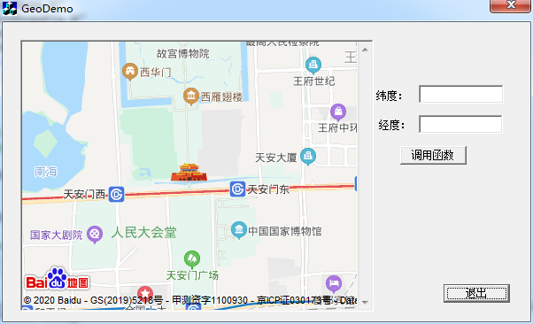

### MFC CWebPage call javascript function
#### 1 create index.html
#### 2 python -m http.server
#### 4 open browser for a test : url-> http://127.0.0.1:8000/index.htm
#### 5 vc++6.0 -> create a project of MFC AppWizard (exe)
#### 6 ......(create control set variable add event handler)
#### 7 add WebPage.h and WebPage.cpp into project
#### 8 GeoDemoDlg.cpp #include "WebPage.h"
#### 9 add code OnInitDialog()
```
m_myweb.Navigate("http://127.0.0.1:8000/index.htm",NULL,NULL,NULL,NULL);
```
#### 10 add code OnCallback()
#### 11 snapshot
 
